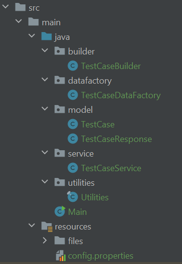

# Gerador de casos de teste no Jira

Este projeto foi desenvolvido com o objetivo de cadastrar casos de teste em massa no Jira usando a api do Zephyr Scale gerando através de um template os métodos de teste ja configurados com os ids dos casos de teste do Jira para integração da execução.

# Tecnologias utilizadas
- Java 11+
- Maven
- Lombok
- Zephyr Scale API
- Jackson-dataformat-csv
- Httpclient

# Padrão de projeto
- Builder Pattern
- Data Factory

# Estrutura de pastas
A estrutura de pastas do projeto é a seguinte:

# Classes definidas
## src/java/
## builder
Esta pasta contém a classe TestCaseBuilder, responsável por construir objetos do tipo TestCase com os dados necessários para criação de um caso de teste no Zephyr Scale.

## datafactory
Esta pasta contém a classe TestCaseDataFactory, responsável por gerar os body requests das requisições.

## model
Esta pasta contém a classe TestCase e TestCaseResponse, responsáveis por representar um caso de teste e objeto de retorno da api.

## service
Esta pasta contém a classe TestCaseService, responsável por executar as operações de cadastro dos casos de teste no Jira e de geração dos metodos template com os ids dos testes cases cadastrados.

## utilities
Esta pasta contém a classe Utilities, que armazena métodos genéricos.

## main/java
Main.class
- Classe que deve ser executada no projeto.

## main/resource/files
Esta pasta contém os arquivos test_cases.csv que é onde escrevemos os casos de teste que serão cadastrados no Jira e o arquivo test-cases_generated.csv que é onde serão escritos os métodos templates de forma automática após cadastro.

## main/resource
config.properties
- Contém os dados de url do zephyr scale, token de acesso e key do projeto no Jira

# Conclusão
Este projeto pode ser utilizado como base para a criação de test cases no Jira, proporcionando uma automação para esse processo. Além disso, a utilização do padrão de projeto Builder permite uma construção mais simples e clara dos objetos TestCase, facilitando a manutenção do código.
